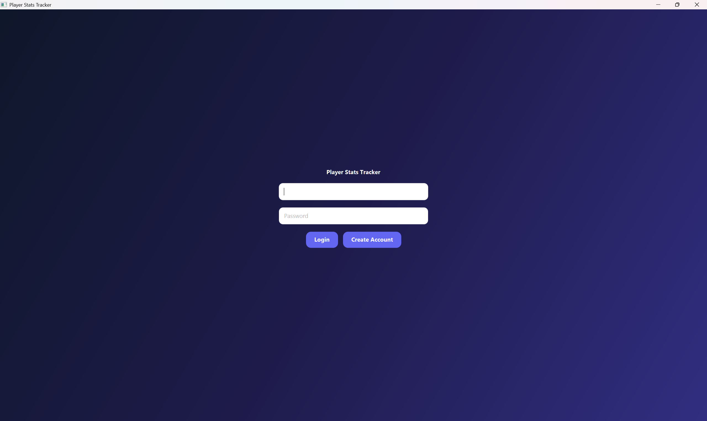
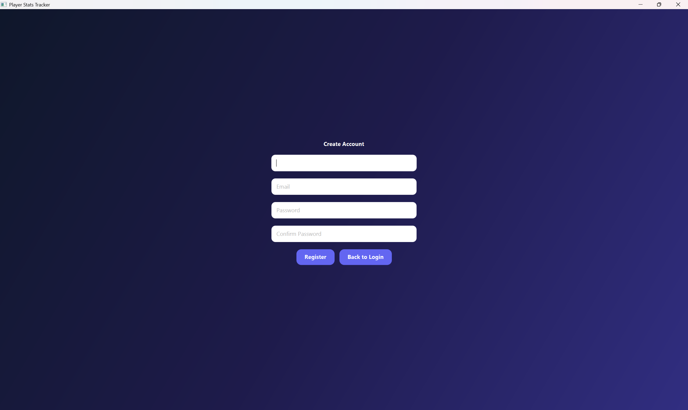
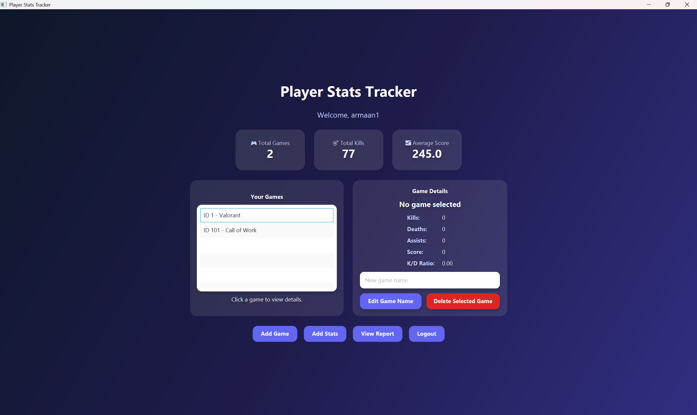

<div align="center">

# Player Statistics Tracker

### A JavaFX desktop application for tracking and analyzing video game performance.

**CSC 311 — Advanced Programming**  
**Farmingdale State College**

</div>

---

## Project Overview

**Player Statistics Tracker** is a Java-based desktop application that allows users to track their performance across different video games. Users can create an account, log in, add games to their personal profile, record match statistics, and view performance summaries through a dashboard and report page.

The goal of this project was to build a full-stack style Java application using a JavaFX frontend, Java backend logic, and an embedded Apache Derby database. The application stores user, game, and statistics data locally and uses that data to generate summaries, charts, and reports.

This project currently focuses on competitive gaming statistics such as kills, deaths, assists, and score. These metrics work well for shooter-style and multiplayer games, but the project architecture can be expanded in the future to support different stat templates for racing games, sports games, RPGs, puzzle games, and other genres.

---

## Main Features

### User Authentication
- Register a new user account
- Log in using saved credentials
- Store the current user session after login
- Keep each user's games and statistics separate

### Game Management
- Add new games to a user profile
- View all games connected to the logged-in user
- Edit selected game names
- Delete selected games and their connected statistics

### Statistics Tracking
- Select a game from a dropdown
- Add match statistics including:
  - Kills
  - Deaths
  - Assists
  - Score
- Load existing statistics for a game
- Update saved statistics
- Clear form fields when needed

### Dashboard
- Displays user-specific performance summaries
- Shows total games, total kills, and average score
- Lists saved games for the logged-in user
- Displays selected game details such as kills, deaths, assists, score, and K/D ratio

### Reports and Data Visualization
- Generates a performance report using stored database records
- Displays charts for kills, deaths, assists, and score
- Shows calculated values such as:
  - Total deaths
  - Total assists
  - Best score
  - K/D ratio
  - Average score

---

## Technology Stack

| Layer | Technology | Purpose |
|------|------------|---------|
| Frontend | JavaFX, FXML | Desktop user interface and screen layouts |
| Styling | CSS | Custom dark theme, buttons, panels, and cards |
| Backend Logic | Java | Controllers, services, validation, and application logic |
| Database | Apache Derby | Embedded local database for persistent storage |
| Build Tool | Maven | Dependency management and project running |
| IDE | IntelliJ IDEA | Development environment |
| Version Control | Git & GitHub | Branching, commits, and collaboration |
| Design | Figma | LoFi wireframes and HiFi design planning |

---

## Application Architecture

The project follows a layered structure to keep the interface, business logic, models, and database code organized.

```text
Player Statistics Tracker
│
├── Presentation Layer
│   ├── JavaFX Controllers
│   ├── FXML Views
│   └── CSS Styling
│
├── Business Logic Layer
│   ├── GameService
│   ├── StatsCalculator
│   └── Session Management
│
├── Model Layer
│   ├── User
│   └── Stats
│
└── Database Layer
    └── ConnDbOps
```
---

## Project Structure

```
src/main/java/org/example/javafxui
│
├── controller
│   ├── AddGameController.java
│   ├── DashboardController.java
│   ├── LoginController.java
│   ├── RegisterController.java
│   ├── ReportController.java
│   └── StatsController.java
│
├── db
│   └── ConnDbOps.java
│
├── model
│   ├── Stats.java
│   └── User.java
│
├── service
│   ├── GameService.java
│   └── StatsCalculator.java
│
├── MainApp.java
└── Session.java

src/main/resources
│
├── styles
│   └── app.css
│
└── view
    ├── AddGame.fxml
    ├── Dashboard.fxml
    ├── Login.fxml
    ├── Register.fxml
    ├── Report.fxml
    └── Stats.fxml
```
---

## Database Design

The application uses Apache Derby as an embedded local database. The database is created automatically when the application starts.

### Main Tables

```
USERS
- user_id
- username
- email
- password

GAMES
- game_id
- user_id
- game_name

STATS
- stat_id
- game_id
- kills
- deaths
- assists
- score
```
---

### Relationships

```
USERS 1 ───────────< GAMES 1 ───────────< STATS
```

One user can have many games.

One game can have many stat records.

Each game is linked to a user through user_id.

Each stat record is linked to a game through game_id.

This design allows the application to keep each user’s games and statistics separate.

---

## How It Works

1. The user opens the application and registers or logs in.
2. After a successful login, the current user is stored in the Session class.
3. The dashboard loads only the games and statistics connected to that user.
4. The user can add games to their profile.
5. The user can select one of their games and add match statistics.
6. The dashboard updates summary cards and selected game details.
7. The report page generates charts and performance summaries from the stored Derby data.

---

## Design Process

The interface was planned using a LoFi design approach.

## LoFi Wireframes

LoFi wireframes were used to plan the basic layout of the application screens before focusing on colors, styling, or final design details.

Planned LoFi screens included:

- Login screen
- Register screen
- Dashboard screen
- Add Stats screen
- Report screen

One major design improvement was moving the charts from the dashboard to a separate report screen. This made the dashboard cleaner and made the report page more focused on performance analytics.

### Figma Prototype

Figma Link: https://www.figma.com/proto/nkVAMPp1Juj1d8VEFxiwBc/Untitled?node-id=1-23&t=p4211wVfu7ab1Ymx-1

---

## Application Screenshots

### Login Screen


### Register Screen


### Dashboard


### Add Game


### Add Stats


### Performance Report


---

## Team Roles

| Team Member   | Role / Contribution                                                                                    |
| ------------- | ------------------------------------------------------------------------------------------------------ |
| Armaan Arora  | Login/register flow, session handling, core logic, dashboard improvements, documentation               |
| Patrick Cortez| Database logic and Derby operations                                                                    |
| Angie Portillo| JavaFX UI screens, controller work, Presentation help and  Testing                                     |
| Kelvin Morales| Charts, reports, Presentation and visualizations                                                       |
| Aman Qais     | Features, UI help                                                                                      |

---

## Citations

### Angie Portillo

For my part of the project I went back to previous assignments (ex: Assignment JavaFX using cards for math formula) to look over the JavaFX code. I used the css styling files and .fxml files as a template and then edited and added multiple new tabs as I went along. I did use homework assignments from another class (Data Structures) to use the methods as an example when implenting everyone else's code with mine.

### Armaan Arora

For the design purposes of the documentation, and fixing the issues I used AI to go over the project and suit in the best possible way to present and fix it. I used the Software engineering class teaching for the structure and importance of sprints. And I used Udemy courses to go over the basics and crutialities of database integration. 

---

## Challenges Faced

During development, one of the biggest challenges was integrating code from multiple branches into one stable project. Different parts of the project were originally developed separately, which made it difficult to connect the database, JavaFX screens, and controller logic.

Another challenge was maintaining consistent styling and window size across scene switches. This was solved by applying the CSS stylesheet every time a new scene was loaded and standardizing the stage size.

The team also had to make sure that users, games, and stats were connected correctly through database relationships so that each user only saw their own data.

---

## Current Limitations

- The current statistics model focuses on competitive games using kills, deaths, assists, and score.
- Other game genres would need custom stat templates.
- There is no online multiplayer leaderboard yet.

---

## Future Improvements
- Add stat templates for different game genres:
  - Racing: lap time, placement, wins
  - Sports: goals, assists, saves
  - RPG: level, quests completed, damage
  - Puzzle: completion time, mistakes, score
- Add leaderboard between users
- Add export to CSV or PDF
- Add date-based match history and filtering
- Add more advanced analytics and charts

---

<div align="center">

Built with Java, JavaFX, CSS, Apache Derby, Maven, and GitHub.

</div>
